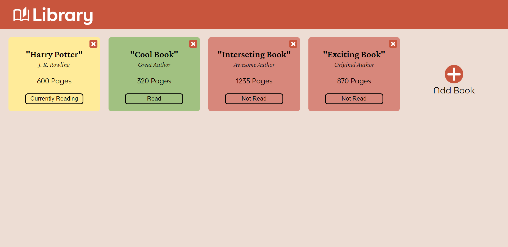

# Library

This project is a part of the "The Odin Project" [curriculum](https://www.theodinproject.com/).

## Table of contents

- [Overview](#overview)
  - [Screenshot](#screenshot)
  - [Links](#links)
- [My process](#my-process)
  - [Built with](#built-with)

## Overview

### Screenshot

### Links

- Solution URL: [View Code](https://github.com/romaleks/Library)
- Live Site URL: [Live Preview](https://romaleks.github.io/Library/)

## My process

### Built with

- Semantic HTML5 markup
- CSS custom properties
- CSS Flexbox and Grid
- JavaScript Object Constructors
- JavaScript Prototypal Inheritance
- Visual Studio Code